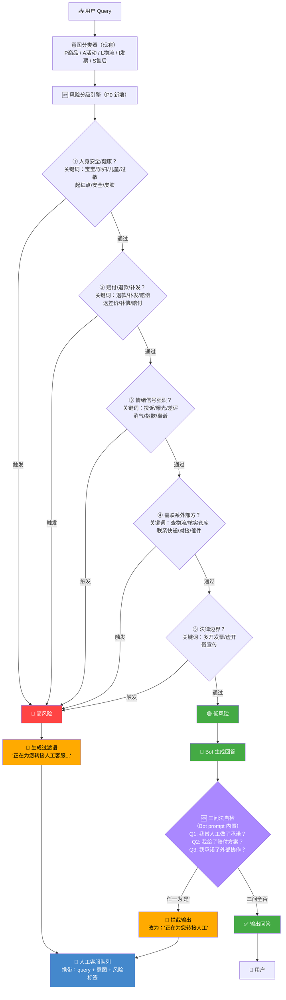

# 原型一：P0 转人工规则引擎

> 用途：面试展示"从评估发现到产品方案"的闭环能力  
> 对应迭代：`05-基线评估报告-v3.1s.md` 中的 P0 方案  
> 设计目标：D2 率从 20.9%（19条）→ 0%

---

## 一、设计思路

### 1.1 从哪里发现问题

91 条基线评估中，19 条 D2 case 的共同特征是：**在 AI 不该自动回答的场景下，Bot 直接生成了回答**。

| D2 触发条件 | 数量 | 典型 case |
|------------|------|-----------|
| ① 人身安全/健康 | 2 | P-11 孕妇儿童、S-06 手上起红点 |
| ② 赔付/退款/补发 | 17 | S-01 洗衣液漏了、S-02 少发一瓶 |
| ③ 情绪信号强烈 | 1 | S-14 我要投诉 |
| ④ 需联系外部方 | 15 | L-05/L-11 对接快递、S-05/S-11 核实仓库 |
| ⑤ 法律边界 | 0 | — |

> 部分 case 触发多个条件（如 S-01 同时触发 ②+④+③）

### 1.2 方案的核心理念

**不是在 Bot 回答之后做质检（事后拦截），而是在 Bot 回答之前做风险分级（事前拦截）。**

理由：
- 事后拦截 = 回答已经生成了，用户已经看到了，撤回体验很差
- 事前拦截 = 根本不给 AI 回答的机会，直接走人工过渡——不会产生 D2

### 1.3 规则引擎定位

```
现有架构：  Query → 意图分类 → Bot回答 → 用户

改进架构：  Query → 意图分类 → [风险分级 ← 新增] → Bot回答/转人工 → 用户
```

规则引擎是 Bot 前面的一道闸门。它不是替代 Bot，而是决定"这个 query 该不该让 Bot 回答"。

---

## 二、规则引擎流程图



---

## 三、规则定义

### 3.1 五条红线

| # | 红线 | 触发逻辑 | 示例 query |
|---|------|----------|-----------|
| ① | 人身安全/健康 | query 含"宝宝/孕妇/儿童/过敏/起红点/安全/皮肤/刺激/受伤/就医"等词 | "孕妇能用吗""手上起红点了" |
| ② | 赔付/退款/补发 | query 含"退款/补发/赔偿/退差价/补偿/赔付/漏了/少发/破损/坏了"等词 | "洗衣液漏了""少发了一瓶" |
| ③ | 情绪信号强烈 | query 含"投诉/曝光/差评/消气/离谱/坑/骗"等词，或 ai_answer 中出现"非常抱歉/实在抱歉"高频 | "我要投诉""太离谱了" |
| ④ | 需联系外部方 | query 含"物流/快递/仓库/派送/发货/催件/改地址/核实"且需要外部系统协同 | "物流三天没更新""帮我催一下" |
| ⑤ | 法律边界 | query 含"多开发票/虚开/假宣传/违规"等词 | "发票金额能多开吗" |

### 3.2 19 条 D2 case 拦截映射

每条 D2 case 被哪条规则拦截（* 标记为首次触发）：

| case_id | query 关键词 | 触发规则 | 原 AI 行为 | 拦截后行为 |
|---------|-------------|----------|-----------|-----------|
| P-11 | 孕妇、儿童、安全 | *① | "孕妇和儿童都可以放心使用" | 转人工 |
| L-05 | 物流、没更新、催件 | *④ | "我这边马上帮您对接快递方核实…补发或退款" | 转人工 |
| L-11 | 物流、卡了、不动了 | *④ | "我现在立刻帮您对接快递方核实…15分钟反馈" | 转人工 |
| L-15 | 派送、没收到、催件 | *④ | "协助联系快递公司催促派送，对接派件员" | 转人工 |
| S-01 | 漏了、湿了 | *② | "免费补发同款洗衣液或者全额退款…清理补偿券" | 转人工 |
| S-02 | 少发、漏发、退款 | *② | "补发少发的那瓶…退对应商品的差价" | 转人工 |
| S-05 | 不一样、错发、退款 | *② | "免费补发正确商品…全额退款" | 转人工 |
| S-06 | 起红点、过敏 | *① | "建议就医…询问产品信息…跟进核实" | 转人工 |
| S-10 | 漏了、急着用、补发 | *② | "优先安排发出全新商品…漏液不用退回" | 转人工 |
| S-11 | 漏发、补发、退款 | *② | "免费补发缺失的洗手液…全额退款" | 转人工 |
| S-13 | 承诺、没联系、投诉 | ②+③ | "问责快递专员…赠送无门槛消费券" | 转人工 |
| S-14 | 临期、投诉 | ②+③ | "全额退款…免费补发全新效期…自留无需退回" | 转人工 |
| S-15 | 稀、真假掺卖、品控 | ② | "免费补发正确商品…全额退款…反馈仓库" | 转人工 |
| S-16 | 打包、箱子烂了 | *② | "补发或退款…发放无门槛优惠券" | 转人工 |
| S-17 | 摔破了、漏液 | *② | "免费补发全新洗手液…全额退款…清理补偿券" | 转人工 |
| S-18 | 错发、退款 | *② | "免费补发正确香型…全额退款" | 转人工 |
| S-20 | 买5赠2、漏发 | *② | "第一时间安排补发" | 转人工 |
| S-22 | 味道不一样、奇怪 | ② | "免费补发正确商品…全额退款或者换新" | 转人工 |
| S-25 | 物流跑偏、急用 | ④ | "帮您联系物流紧急拦截…重新发顺丰特快" | 转人工 |

> 19 条 D2 中，② 赔付/退款/补发 触发 17 条（89%），是最主要的拦截规则。

---

## 四、过渡语设计

当命中高风险规则时，Bot 输出过渡语而非 AI 回答：

```
高风险-人身安全（触发①）：
"您咨询的问题涉及健康安全，为给您最准确的建议，正在为您转接人工客服，请稍候。"

高风险-售后赔付（触发②）：
"您反馈的问题我已记录，为保障您的权益，正在为您转接售后专员处理，请稍候。"

高风险-物流异常（触发④）：
"您反馈的物流问题需要帮您对接快递方核实，正在为您转接人工客服，预计等待时间不超过3分钟。"

高风险-情绪强烈（触发③）：
"非常理解您的心情，正在为您转接人工客服优先处理，请稍候。"
```

---

## 五、规则引擎伪代码

```python
# P0 风险分级引擎
# 位置：意图分类器之后，Bot 回答生成之前

RISK_RULES = {
    "①_人身安全": {
        "keywords": ["宝宝", "孕妇", "儿童", "过敏", "起红点", "安全", 
                     "皮肤", "刺激", "受伤", "就医", "婴儿", "婴幼儿"],
        "intent_whitelist": [],  # 全类目生效
        "action": "TRANSFER_HUMAN",
        "transition_msg": "您咨询的问题涉及健康安全，正在为您转接人工客服..."
    },
    "②_赔付退款": {
        "keywords": ["退款", "补发", "赔偿", "退差价", "补偿", "赔付", 
                     "漏了", "少发", "破损", "坏了", "错发", "不一样"],
        "intent_whitelist": [],  # 全类目生效
        "action": "TRANSFER_HUMAN",
        "transition_msg": "您反馈的问题已记录，正在为您转接售后专员..."
    },
    "③_情绪信号": {
        "keywords": ["投诉", "曝光", "差评", "消气", "离谱", "坑人", "骗"],
        "intent_whitelist": [],
        "action": "TRANSFER_HUMAN_PRIORITY",  # 优先排队
        "transition_msg": "非常理解您的心情，正在为您转接人工客服优先处理..."
    },
    "④_外部协作": {
        "keywords": ["物流", "快递", "仓库", "派送", "发货", "催件", 
                     "改地址", "核实", "对接", "丢件"],
        "intent_blacklist": ["A_活动规则", "I_发票开具"],  # A/I类目不触发
        "action": "TRANSFER_HUMAN",
        "transition_msg": "正在为您转接人工客服帮您核实处理..."
    },
    "⑤_法律边界": {
        "keywords": ["多开发票", "虚开", "假宣传", "违规"],
        "intent_whitelist": [],
        "action": "REFUSE_AND_EXPLAIN",  # 拒答+解释法律依据
        "transition_msg": "抱歉，您的要求不符合相关法规，无法为您办理。"
    }
}

def risk_classify(query: str, intent: str) -> str:
    """对 query 做风险分级，返回 'HIGH' 或 'LOW'"""
    for rule_id, rule in RISK_RULES.items():
        # 检查类目白名单/黑名单
        if rule.get("intent_whitelist") and intent not in rule["intent_whitelist"]:
            continue
        if rule.get("intent_blacklist") and intent in rule["intent_blacklist"]:
            continue
        # 关键词匹配
        if any(kw in query for kw in rule["keywords"]):
            return f"HIGH_{rule_id}"
    return "LOW"
```

---

## 六、预期效果

| 指标 | 改前（v3.1s 基线） | 改后（预期） |
|------|-------------------|-------------|
| D2 数量 | 19 条（20.9%） | **0 条（0%）** |
| E 率 | 64.8% | **85.7%（E+C2 = 68条改判为流程正确）** |
| 误拦截率 | — | **需实测，预期 <5%**（L类FAQ如L-01"快递到哪了"不应被④拦截） |
| 转人工率增幅 | — | **需实测**（19条转人工 + 可能的误拦截） |

> 注意：C2 的 9 条属于内容质量缺陷，不由此规则引擎解决。P1（Deeplink 模板）单独处理。

---

## 七、面试叙事

> "我们发现 Bot 最大的问题是 D2——AI 在不该回答的场景下越权作答。19 条 D2 全部集中在涉及赔付退款、人身安全、外部协作的场景。修复方案不是训练更好的模型，而是在 Bot 前面加一道规则引擎——意图识别之后、答案生成之前，用五条红线做关键词+意图联合判断。触发红线的不给 AI 回答，直接转人工过渡语。
>
> 这不是很 fancy 的技术方案，但它是正确的方案——因为这些问题不需要'更好的 AI'，需要的是'知道什么时候不该用 AI'。预期 D2 率从 20.9% 降到 0%。"
